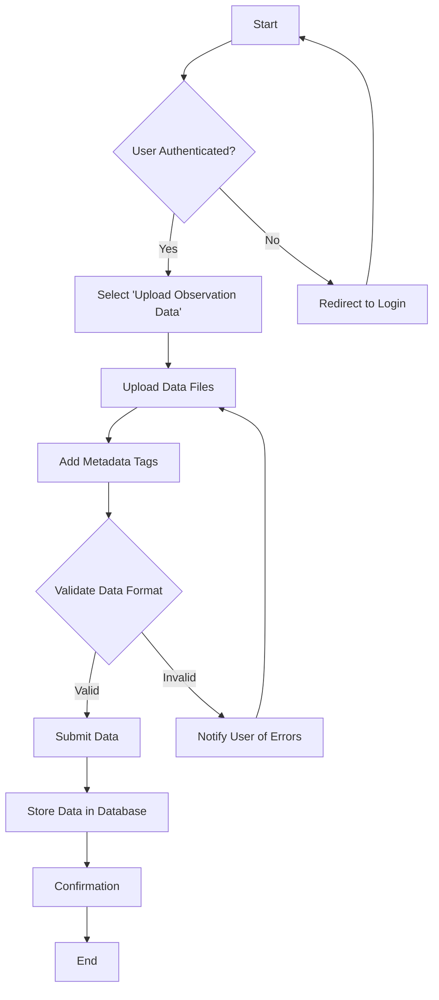
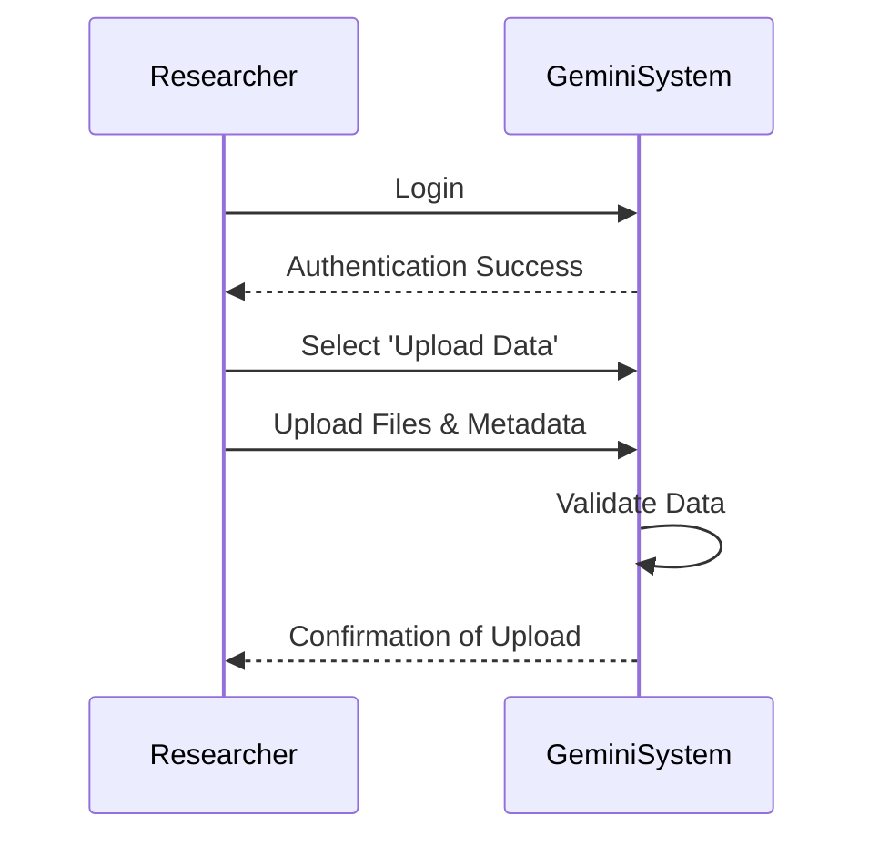
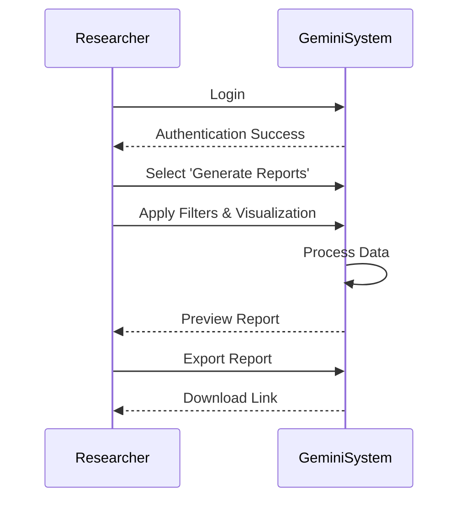
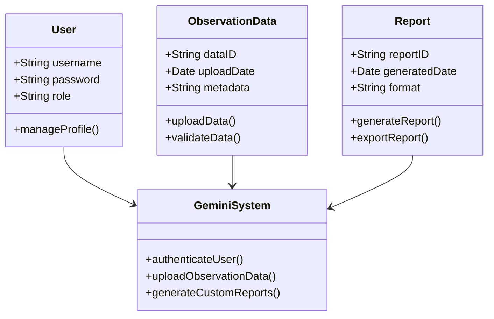

# Gemini Project - Use Case Analysis

## 1. Introduction

This document provides the analysis of two selected use cases for the Gemini Project. Each use case includes a description, an activity diagram, and a sequence diagram. Additionally, a class diagram representing the system's structure is provided.

---

## 2. Use Case 1: Upload Observation Data

### 2.1 Use Case Description

* **Actor:** Researcher
* **Goal:** To upload new observation data and categorize it for future analysis.
* **Preconditions:** The user must be authenticated.
* **Postconditions:** The data is successfully uploaded, categorized, and stored in the system database.
* **Main Flow:**
  1. Researcher logs into the system.
  2. Selects "Upload Observation Data."
  3. Uploads data files and adds metadata tags.
  4. System validates data format and integrity.
  5. Researcher submits the data.
  6. System saves the data and confirms successful upload.

### 2.2 Activity Diagram



### 2.3 Sequence Diagram



---

## 3. Use Case 2: Generate Custom Reports

### 3.1 Use Case Description

* **Actor:** Researcher
* **Goal:** To create custom reports based on selected observation data.
* **Preconditions:** The user must be authenticated with reporting privileges.
* **Postconditions:** The generated report is available for download in the chosen format.
* **Main Flow:**
  1. Researcher logs into the system.
  2. Selects "Generate Custom Reports."
  3. Applies data filters and selects visualization options.
  4. System processes the data.
  5. Researcher previews the report.
  6. Researcher exports the report in the desired format (PDF, Excel).

### 3.2 Activity Diagram

```mermaid
flowchart TD
    Start([Start]) --> AuthCheck{User Authenticated?}
    AuthCheck -- Yes --> SelectReport[Select 'Generate Custom Reports']
    SelectReport --> ApplyFilters[Apply Data Filters]
    ApplyFilters --> ChooseViz[Choose Visualization Options]
    ChooseViz --> ProcessData[Process Data]
    ProcessData --> PreviewReport[Preview Report]
    PreviewReport --> ExportCheck{Export Format Selected?}
  
    ExportCheck -- Yes --> ExportReport[Export Report (PDF/Excel)]
    ExportReport --> DownloadReport[Download Report]
    DownloadReport --> End([End])
  
    ExportCheck -- No --> PromptFormat[Prompt to Select Format]
    PromptFormat --> ExportCheck

    AuthCheck -- No --> RedirectLogin[Redirect to Login]
    RedirectLogin --> Start

```

### 3.3 Sequence Diagram



---

## 4. Class Diagram



---

## 5. Conclusion

This document provides a detailed analysis of two key use cases in the Gemini Project: **Upload Observation Data** and  **Generate Custom Reports** . The activity diagrams, sequence diagrams, and class diagram offer a comprehensive view of the system's structure and interactions.
