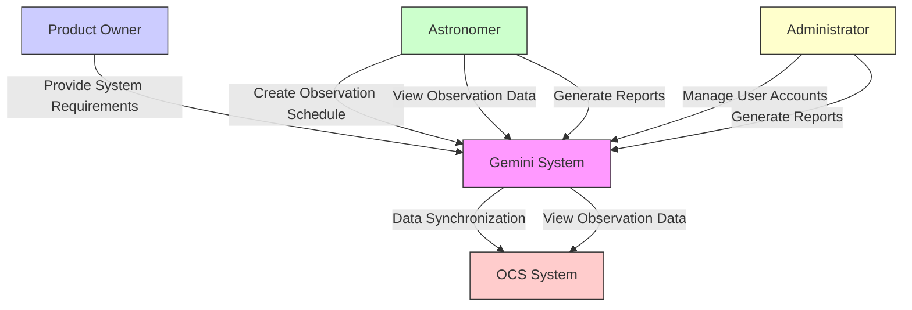

# Gemini Project - Use Case Diagram

## 1. Introduction

This document presents the **Use Case Diagram** for the Gemini Project, illustrating the interactions between users (actors) and the system.

## 2. Actors

* **Astronomer:** Primary user responsible for scheduling observations and managing data.
* **System Administrator:** Manages user accounts, system configurations, and ensures data security.
* **OCS System:** External system that provides real-time observation data.
* **Product Owner (AURA):** Provides system requirements and oversees the development process.

## 3. Use Cases

* **Manage User Accounts:** Create, update, and delete user accounts with different roles.
* **Create Observation Schedule:** Allow astronomers to schedule and modify observation plans.
* **View Observation Data:** Access and analyze observation data from the OCS system.
* **Generate Reports:** Generate observation reports in different formats (PDF, CSV).
* **Data Synchronization with OCS:** Ensure real-time data updates between the Gemini system and OCS.

## 4. Use Case Diagram

## 5. Description of Relationships

* **Product Owner → Gemini System:** Provides business requirements.
* **Astronomer → Create Observation Schedule:** Manages observation tasks.
* **Administrator → Manage User Accounts:** Controls user roles and system settings.
* **Gemini System ↔ OCS System:** Ensures real-time data synchronization.

---

## 6. Conclusion

This use case diagram outlines the primary interactions within the Gemini system. It helps identify the system's key functionalities and the roles involved.
