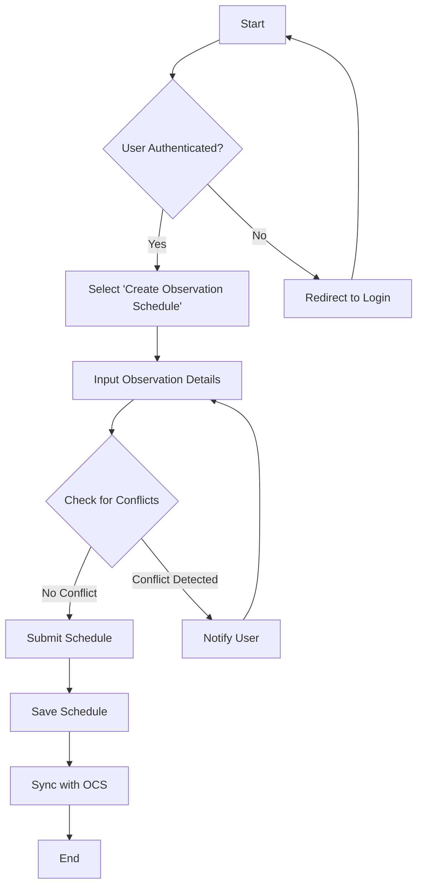
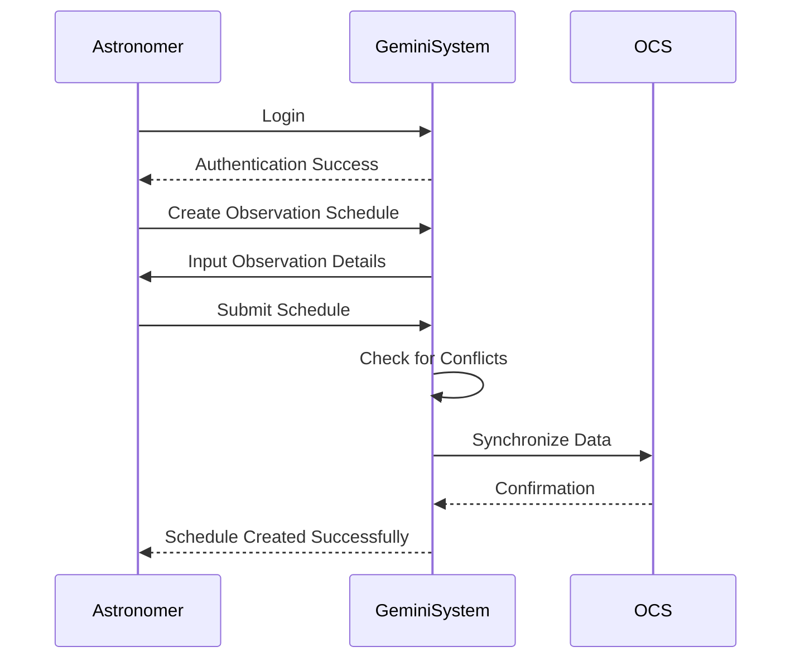
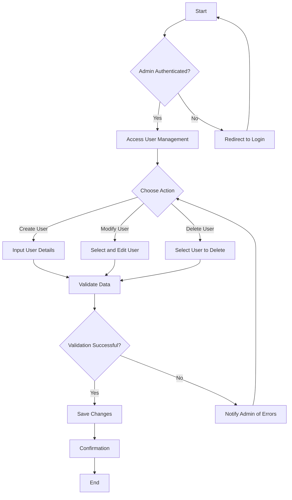
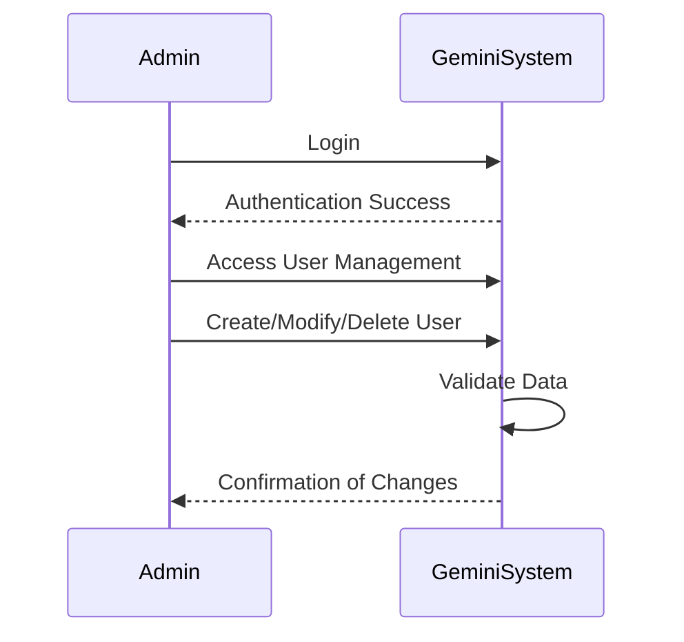
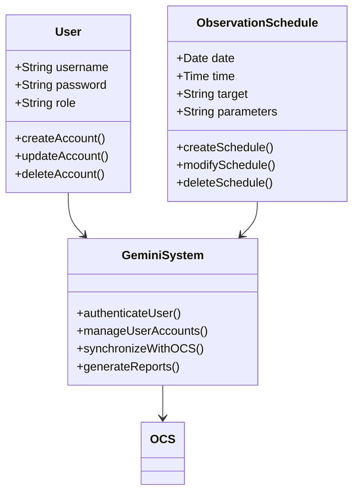

# Gemini Project - Use Case Analysis

## 1. Introduction

This document provides the analysis of two selected use cases for the Gemini Project. Each use case includes a description, an activity diagram, and a sequence diagram. Additionally, a class diagram representing the system's structure is provided.

---

## 2. Use Case 1: Create Observation Schedule

### 2.1 Use Case Description

* **Actor:** Astronomer
* **Goal:** To create, modify, and manage observation schedules.
* **Preconditions:** The user must be authenticated.
* **Postconditions:** The observation schedule is saved and synchronized with the OCS system.
* **Main Flow:**
  1. Astronomer logs into the system.
  2. Selects "Create Observation Schedule."
  3. Inputs observation details (date, time, target, parameters).
  4. System checks for scheduling conflicts.
  5. Astronomer confirms and submits the schedule.
  6. System saves the schedule and synchronizes with OCS.

### 2.2 Activity Diagram

### 2.3 Sequence Diagram

---

## 3. Use Case 2: Manage User Accounts

### 3.1 Use Case Description

* **Actor:** System Administrator
* **Goal:** To create, update, and delete user accounts with role-based permissions.
* **Preconditions:** The administrator must be authenticated with admin privileges.
* **Postconditions:** User account changes are updated in the system database.
* **Main Flow:**
  1. Administrator logs into the system.
  2. Navigates to "User Management."
  3. Selects to create, modify, or delete a user.
  4. Inputs user details and role permissions.
  5. System validates the data.
  6. Changes are saved, and confirmation is provided.

### 3.2 Activity Diagram

### 3.3 Sequence Diagram

---

## 4. Class Diagram

---

## 5. Conclusion

This document provides the detailed analysis of two key use cases in the Gemini Project: **Create Observation Schedule** and  **Manage User Accounts** . The activity diagrams, sequence diagrams, and class diagram offer a comprehensive view of the system's structure and interactions.
